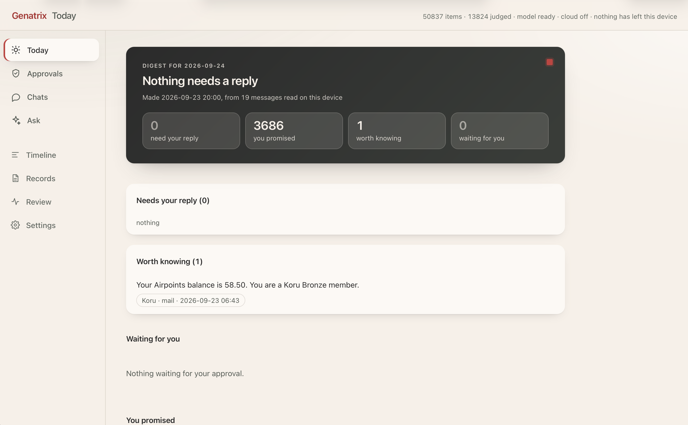

# Genatrix

An AI that runs only on your device, understands your digital life, and acts
only with your approval.



Your mail and messages are downloaded to your own computer, encrypted with
your own key, and read there by a model running on the same machine. Nothing
leaves without you knowing.

- **One timeline.** Gmail and Telegram in a single stream, searchable by words
  and by meaning.
- **Read on your machine.** A local model sorts, summarizes and drafts. The
  cloud is off, and the records page shows how many bytes have left the device.
- **Three levels of sensitivity.** Public, personal, secret. Rules you can read
  set the floor, the model may raise it, only you may lower it.
- **Nothing happens without you.** A reply, or anything else, is a draft until
  you approve the exact version you read.
- **Agents in a sandbox.** Install functional agents (tax, travel, your own):
  they read only what their manifest names, reach no network, and propose
  rather than act.
- **Yours to leave.** Export everything as plain JSON, or delete everything, in
  one step.

No accounts, no servers, no telemetry.

## Run it locally

You need an Apple Silicon Mac with 16 GB of memory, about 20 GB free, Rust,
and the Metal toolchain:

```sh
xcodebuild -downloadComponent MetalToolchain
```

Build (the first build takes several minutes):

```sh
cargo build --release --workspace
swift build -c release --package-path apps/menubar
cp apps/menubar/.build/release/genatrix-menubar target/release/
```

Start it, from now on at every login, with a menu bar icon:

```sh
./target/release/genatrix service install
```

Open <http://127.0.0.1:7717>. The first-run page walks you through the rest:
download the models (about 5 GB), then add a mailbox (on Gmail, an
[app password](https://myaccount.google.com/apppasswords)) and Telegram from
**Settings**.

To try it without starting at login, run `./target/release/genatrix serve`
instead. `service uninstall` removes it again.

Telegram needs application credentials from
[my.telegram.org](https://my.telegram.org), set when you build:

```sh
export GENATRIX_TELEGRAM_API_ID=...
export GENATRIX_TELEGRAM_API_HASH=...
```

### From your phone

Bind Genatrix to a private network (Tailscale, WireGuard, or a home network
you trust), then pair the phone from **Settings → Paired devices**:

```sh
./target/release/genatrix service install --bind 0.0.0.0
```

### Agents

Install an agent from **Settings → Agents**: before you agree, you see what
it may read and propose, and a trial run on your recent mail. Agents are
built in [`agents/`](agents/) against one contract,
[`wit/genatrix-agent.wit`](wit/genatrix-agent.wit):

```sh
rustup target add wasm32-wasip2
agents/build.sh    # packages land in agents/target/packages/
```

## Useful commands

```sh
genatrix service status              # installed and running?
genatrix agent list                  # installed agents
genatrix purge telegram --dry-run    # what fetching Telegram again would remove
genatrix export --to ~/genatrix-export
```

Add `--data-dir <dir>` to any command to use a separate development directory.

## Building the app

```sh
packaging/package-macos.sh    # dist/Genatrix.app and a disk image
```

Set `GENATRIX_SIGN_IDENTITY` and `GENATRIX_NOTARY_PROFILE` for a signed,
notarized build. The app and `service install` use the same port; run one or
the other on a machine.

## Development

```sh
cargo fmt --all
cargo clippy --workspace --all-targets -- -D warnings
cargo test --workspace
cd web && npm ci && npm run check && npm run build   # when web/ changes
```

- [Design documents](docs/design/), in Chinese. Start with
  [00 Vision and Principles](docs/design/00-vision.md).
- [Implementation plan](docs/plan/), in English.

## License

MIT OR Apache-2.0.
